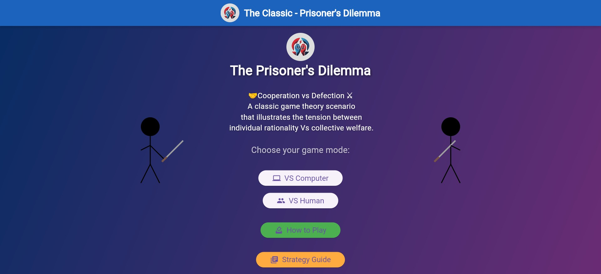
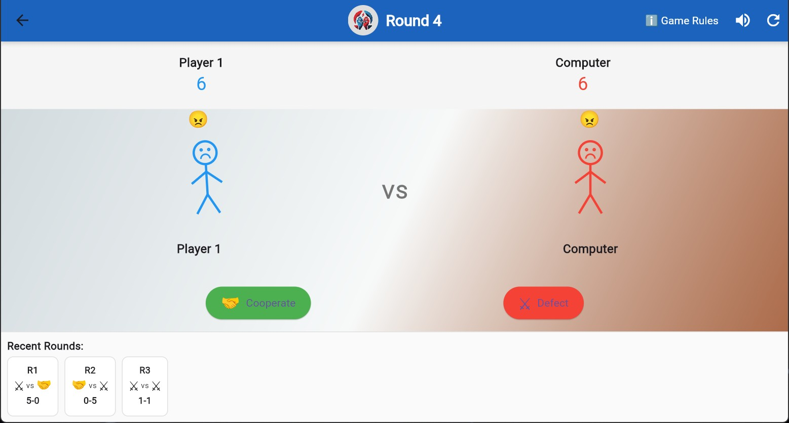
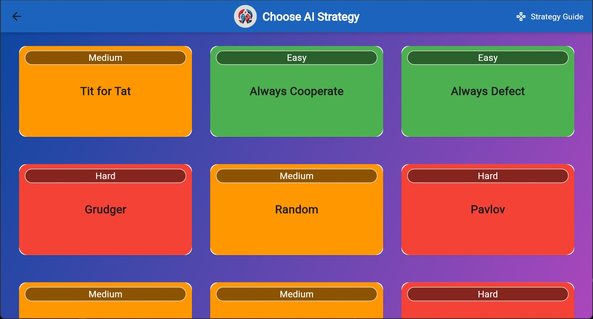

# The Prisoner's Dilemma


A comprehensive Flutter application implementing the classic Prisoner's Dilemma game theory concept. The game features multiple AI strategies, local multiplayer, animated visuals, and educational content about game theory. It provides both entertainment and educational value by demonstrating various strategies in the iterated Prisoner's Dilemma.


## Screenshot





### [Play game 🎮!](awes0m.github.io/the_prisoners_dilema)

## Structure

- **lib/**: Core application code organized in MVC-like pattern
  - **common/**: Shared utilities, enums, and constants
  - **models/**: Data models and strategy implementations
  - **repository/**: State management with Riverpod
  - **view/**: Screen implementations
  - **widgets/**: Reusable UI components
- **assets/**: Application assets including images
- **android/**, **ios/**, **web/**, **linux/**, **macos/**, **windows/**: Platform-specific code
- **test/**: Test files (currently commented out)

## 🎮 **Key Features :**

### **Game Modes:**

- **User vs Computer** with 10 different AI strategies
- **User vs User** for local multiplayer
- Strategy selection screen with difficulty indicators

### **Visual Elements:**

- **Animated stick figures** that react to player choices
- Stick figures show cooperation (🤝) or defection (⚔️) symbols
- Smooth animations with elastic effects when actions are chosen
- Custom painted stick figures with color coding (blue/red)

### **Game Logic:**

- **Complete payoff matrix** implementation (3,3 / 5,0 / 0,5 / 1,1)
- **Win conditions** : First to 50 points or after 20 rounds
- Real-time score tracking and round history
- Game end screen with final results

### **AI Strategies (10 Total):**

1. **Tit for Tat** - Classic reciprocal strategy
2. **Always Cooperate** - Trusting angel
3. **Always Defect** - Exploitative devil
4. **Grudger** - Unforgiving punishment
5. **Random** - 50/50 probability
6. **Pavlov** - Win-stay, lose-shift
7. **Generous Tit for Tat** - Forgiving reciprocal
8. **Tit for Two Tats** - More patient retaliation
9. **Suspicious Tit for Tat** - Starts with defection
10. **Generous** - Mostly cooperative with testing

### **Strategy Encyclopedia:**

- **Comprehensive strategy guide** with expandable cards
- Each strategy includes:
  - Detailed description and behavior
  - Strengths and weaknesses analysis
  - Example gameplay sequences
- **Interactive payoff matrix** dialog
- Visual explanations of game theory concepts

### **State Management:**

- **Riverpod** for all game state management
- Reactive UI updates
- Persistent game history
- Clean separation of game logic and UI

### **Responsive Design:**

- Works on mobile and web
- Adaptive layouts
- Touch-friendly controls
- Scrollable history display

### **Advanced Features:**

- **Round history visualization** with action icons
- **Animated feedback** when actions are selected
- **Difficulty ratings** for AI strategies
- **Game reset functionality**
- **Navigation between all screens**

## Language & Runtime

**Language**: Dart
**Version**: SDK ^3.8.1
**Framework**: Flutter
**Package Manager**: pub (Flutter/Dart package manager)

## Dependencies

**Main Dependencies**:

- flutter: SDK
- cupertino_icons: ^1.0.8
- flutter_riverpod: ^2.6.1
- pwa_install: ^0.0.6

**Development Dependencies**:

- flutter_test: SDK
- flutter_lints: ^5.0.0
- flutter_launcher_icons: ^0.14.4

## Build & Installation

```bash
# Get dependencies
flutter pub get

# Run in development mode
flutter run

# Build for web
flutter build web

# Build for Android
flutter build apk

# Build for iOS
flutter build ios

# Generate launcher icons
flutter pub run flutter_launcher_icons
```

## Testing

**Framework**: flutter_test
**Test Location**: test/
**Naming Convention**: *_test.dart
**Run Command**:

```bash
flutter test
```
